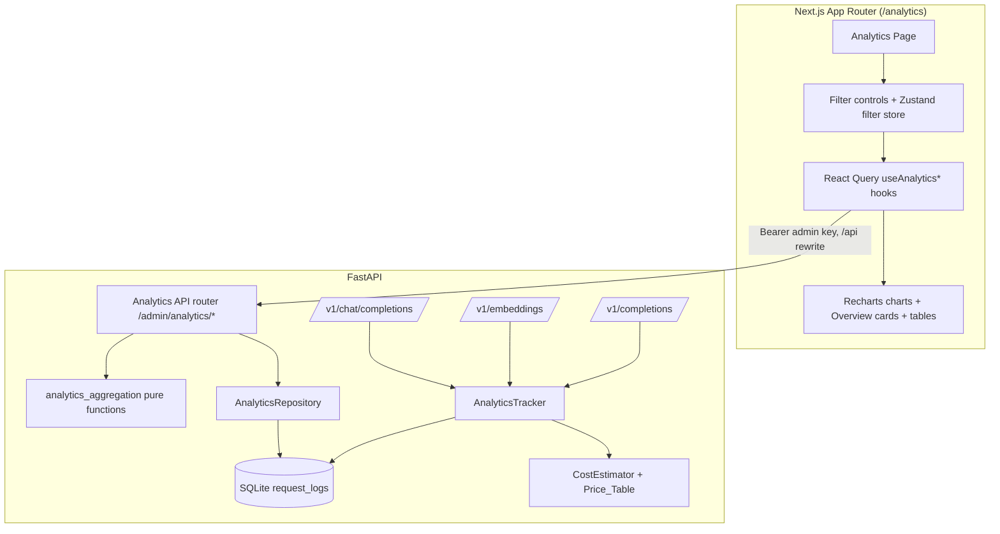
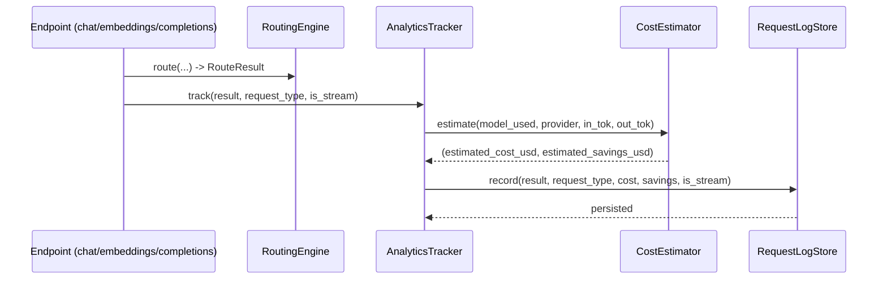
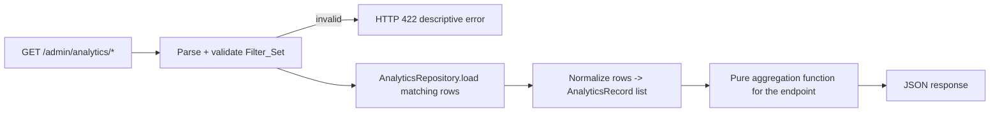

# Design Document

## Overview

The Analytics Dashboard adds an observability surface to NexusLLM without rebuilding the signals NexusLLM already captures. Every routed request already produces a `RouteResult` (`backend/models/responses.py`) carrying provider, model, token usage, latency, status, and per-attempt detail, and that result is persisted to the SQLite `request_logs` table by `RequestLogStore` (`backend/core/request_log.py`). The feature layers four capabilities on top of that foundation:

1. **Standardized tracking** — a thin `AnalyticsTracker` that all three routed endpoints (chat, embeddings, completions) call with the same contract, so every request records an identical field set plus its `request_type` and a computed cost/savings estimate.
2. **Cost and savings estimation** — a pure `CostEstimator` backed by a per-model `Price_Table` that converts token counts into paid-equivalent US-dollar figures. Because all configured providers run on free or trial tiers, the "cost avoided" equals the cost that a paid provider would have charged.
3. **Analytics API** — a set of admin-authenticated FastAPI endpoints (`/admin/analytics/*`) that read `request_logs`, apply a shared `Filter_Set`, and return overview metrics, per-provider and per-model breakdowns, time-bucketed series, recent errors, and a queryable recent-requests page. The aggregation logic is factored into **pure functions** so it can be exhaustively property-tested.
4. **Analytics page** — a new Next.js App Router page at `/analytics`, reachable from a new NavBar tab, that renders overview cards, provider/model sections, interactive charts, a recent-errors view, and a live recent-requests table. It reuses the existing dashboard visual language (rounded-3xl cards, `border-white/[0.06]`, `bg-bg-secondary/50`) and theme tokens, and is responsive with explicit loading and empty states.

### Key design decisions

- **Compute cost/savings once, at write time, and persist them.** Requirement 1.5 states the tracker SHALL *record* both values. Persisting `estimated_cost_usd` and `estimated_savings_usd` (alongside the existing token columns) makes every analytics aggregation a simple sum and avoids recomputing across thousands of rows on every query. The `Price_Table` snapshot used is documented as a known trade-off (a later price change does not retroactively rewrite historical rows).
- **Aggregate in Python over a bounded row set, using pure functions.** `request_logs` is already trimmed to `max_request_log_entries` (default 1000). Loading the filtered rows and aggregating in-process keeps the logic database-agnostic, trivially unit/property-testable, and fast at this scale. The aggregation module takes a normalized list of records and returns plain data — no I/O, no globals.
- **Reuse the existing admin auth.** Analytics endpoints mount under the existing `/admin` surface and depend on `require_admin`, inheriting the Bearer-token behavior (401 on missing/invalid) with zero new auth code.
- **Recharts for charts.** See Architecture → Charting Library Choice.
- **Derive `success` and request timestamp rather than add redundant columns.** Success is `200 <= status_code < 300`; the request (start) timestamp is the recorded response `timestamp` minus `total_latency_ms`. Only the genuinely new fields (`request_type`, `estimated_cost_usd`, `estimated_savings_usd`) are added to the schema.

## Architecture

### System context



### Request-tracking flow



### Analytics-query flow



### Charting Library Choice

**Decision: Recharts.**

Rationale:
- Recharts ships a `ResponsiveContainer` that re-renders charts to the available width on viewport changes, directly satisfying Requirement 15.5 with no custom resize logic.
- It is a declarative React component library (SVG-based), so charts are plain client components that fit the existing App Router + "use client" pattern and accept theme colors as props — letting us drive stroke/fill from the same CSS variables (`--accent`, `--text-secondary`, etc.) used elsewhere, satisfying theme support (Requirement 19.2).
- It covers every required chart type (line/area for trends, bar for distributions, pie/donut for provider and error distribution, stacked/grouped bar for input-vs-output and success-vs-failed) from one dependency.
- It is widely used with Next.js 14 and has no peer conflicts with the installed React 18 / framer-motion stack.

Considered alternatives: Chart.js + react-chartjs-2 (canvas; imperative, heavier theming for CSS-variable colors), nivo (larger bundle, more dependencies), visx (lower-level, more code per chart). Recharts gives the best effort-to-coverage ratio for this dashboard.

Installation (frontend): add `recharts` to `package.json` dependencies and run the package install. No backend dependency changes are required (standard library + existing `aiosqlite`).

## Components and Interfaces

### Backend

#### 1. Price_Table and CostEstimator (`backend/core/pricing.py`, new)

A pure module with no I/O.

```python
@dataclass(frozen=True)
class ModelPrice:
    input_per_million: float   # USD per 1,000,000 input tokens
    output_per_million: float  # USD per 1,000,000 output tokens

# Maps a concrete model id -> ModelPrice (paid-equivalent reference prices).
PRICE_TABLE: dict[str, ModelPrice] = { ... }

class CostEstimator:
    def __init__(self, price_table: dict[str, ModelPrice] = PRICE_TABLE) -> None: ...

    def estimate_cost(self, model: str | None, input_tokens: int, output_tokens: int) -> float:
        """Return paid-equivalent USD cost. Unknown model -> 0.0 (Req 3.3)."""

    def estimate(
        self, *, model: str | None, provider_category: str | None,
        input_tokens: int, output_tokens: int,
    ) -> tuple[float, float]:
        """Return (estimated_cost, estimated_savings). For a free-tier
        provider, savings == cost (Req 3.4); otherwise savings == 0.0."""
```

- Cost formula (Req 3.2): `input_tokens * price.input_per_million / 1_000_000 + output_tokens * price.output_per_million / 1_000_000`.
- Unknown model → cost `0.0` (Req 3.3); both prices treated as 0.
- Free-tier classification: a provider whose configured `category` is `free` or `trial` is non-paid, so `savings = cost` (Req 3.4). The provider category is resolved from config at write time.
- All values are USD floats (Req 3.5), rounded for storage to 6 decimal places to keep sub-cent precision.

#### 2. AnalyticsTracker (`backend/core/analytics.py`, new)

Standardizes recording across endpoints (Req 1.1–1.5, 3.x). It is the single call site the three endpoints use, replacing the bespoke `_log` helper in `chat.py` and the inline `store.record(...)` blocks in `embeddings.py`/`completions.py`.

```python
class AnalyticsTracker:
    def __init__(self, store: RequestLogStore, estimator: CostEstimator,
                 config: NexusLLMConfig) -> None: ...

    async def track(self, result: RouteResult, *, request_type: RequestType,
                    is_stream: bool) -> None:
        """Compute cost/savings, then persist the standardized record.
        Never raises into the request path (logs and swallows errors)."""
```

- `RequestType = Literal["chat", "embeddings", "completions"]`.
- Resolves `provider_category` from `config.get_provider(result.final_provider)`.
- Token fields come from `result.prompt_tokens` (input) and `result.completion_tokens` (output); both already default to 0 when usage is absent (Req 1.4). Total = input + output.
- Success outcome derived from `result.success` / `result.status_code`; failure path also carries `status_code` and `error_reason` (Req 1.2).
- Wired in `main.py` lifespan as `app.state.analytics_tracker`; endpoints call it instead of `request_log.record` directly, guarded by the existing `config.app.enable_request_logging` flag.

#### 3. RequestLogStore changes (`backend/core/request_log.py`)

- **Schema migration (Req 2.1, 2.2):** `init_db` adds three columns when absent, via `PRAGMA table_info(request_logs)` then `ALTER TABLE request_logs ADD COLUMN ...`:
  - `request_type TEXT NOT NULL DEFAULT 'chat'`
  - `estimated_cost_usd REAL NOT NULL DEFAULT 0`
  - `estimated_savings_usd REAL NOT NULL DEFAULT 0`
  Existing rows are preserved; the `DEFAULT 'chat'` makes legacy rows read back as `chat` (Req 2.3).
- **`record(...)`** gains `request_type`, `estimated_cost_usd`, `estimated_savings_usd` parameters and writes them.
- The recent-entries trim logic is unchanged.

#### 4. AnalyticsRepository (`backend/core/analytics_repository.py`, new)

Thin async data-access layer over the same SQLite file. It loads rows matching the date range (the cheapest SQL-level filter) and returns normalized `AnalyticsRecord` objects; finer filters and all aggregation happen in pure functions.

```python
class AnalyticsRepository:
    def __init__(self, db_path: str | Path) -> None: ...
    async def load(self, start: datetime, end: datetime) -> list[AnalyticsRecord]: ...
```

`AnalyticsRecord` is a normalized, JSON-serializable dataclass (see Data Models). Normalization applies the `request_type` default (`chat`) and `success = 200 <= status_code < 300`, and computes `error_type` from the attempts' `failure_class` / status.

#### 5. analytics_aggregation (`backend/core/analytics_aggregation.py`, new) — pure functions

All endpoint logic lives here as deterministic, side-effect-free functions over `list[AnalyticsRecord]`. This is the property-tested core.

```python
def apply_filters(records, filters: FilterSet) -> list[AnalyticsRecord]
def build_overview(records) -> Overview
def build_provider_breakdown(records) -> list[ProviderStat]
def build_model_breakdown(records) -> list[ModelStat]
def build_time_series(records, start, end, interval) -> TimeSeriesBundle
def select_bucket_interval(start, end) -> timedelta          # Req 7.6
def recent_errors(records, limit) -> list[ErrorEntry]        # Req 8
def query_requests(records, search, sort_by, sort_dir,
                   page, page_size) -> tuple[list[RequestRow], int]  # Req 9
```

#### 6. Analytics API router (`backend/api/analytics.py`, new)

Mounted in `main.py`; every route depends on `require_admin` (Req 11). Routes:

| Method & path | Purpose | Key query params |
|---|---|---|
| `GET /admin/analytics/overview` | Aggregate cards (Req 4) | Filter_Set |
| `GET /admin/analytics/providers` | Per-provider stats (Req 5) | Filter_Set |
| `GET /admin/analytics/models` | Per-model stats (Req 6) | Filter_Set |
| `GET /admin/analytics/timeseries` | Time-bucketed series + distributions (Req 7) | Filter_Set + `interval` |
| `GET /admin/analytics/errors` | Recent failed requests (Req 8) | Filter_Set + `limit` |
| `GET /admin/analytics/requests` | Queryable request rows (Req 9) | Filter_Set + `search`,`sort_by`,`sort_dir`,`page`,`page_size` |

- Shared `Filter_Set` query params: `start`, `end` (ISO timestamps; default = last 24h, Req 4.8), `provider`, `model`, `status` (`success`|`failed`), `request_type`, `min_tokens`, `max_tokens`.
- A `parse_filters` dependency validates inputs and raises `HTTPException(422)` with a descriptive message on invalid values (Req 10.7).
- Each handler: `parse_filters` → `repository.load(start, end)` → `apply_filters` → endpoint aggregation → JSON.

### Frontend

#### Routing & navigation
- `frontend/app/analytics/page.tsx` — the page (client component) (Req 12.3).
- `frontend/components/ui/NavBar.tsx` — add `{ href: "/analytics", label: "Analytics" }` to `TABS`; existing active-state logic handles Req 12.1–12.2.

#### Data layer
- `frontend/lib/api.ts` — add `api.analytics.{overview,providers,models,timeseries,errors,requests}(filters)` using the existing admin-authenticated `getJSON` helper and the `/api/*` rewrite. A `toQueryString(filters)` helper serializes the `Filter_Set`.
- `frontend/lib/types.ts` — add response types mirroring the backend contracts (Overview, ProviderStat, ModelStat, TimeSeriesBundle, ErrorEntry, RequestRow, paginated wrapper, FilterSet).
- `frontend/hooks/useAnalytics.ts` — React Query hooks keyed by the `Filter_Set` (so changing filters refetches), with `refetchInterval` for auto-update (Req 13.2, 15.2). Hooks: `useAnalyticsOverview`, `useAnalyticsProviders`, `useAnalyticsModels`, `useAnalyticsTimeSeries`, `useAnalyticsErrors`, `useAnalyticsRequests`.
- `frontend/store/analyticsFilters.ts` — a Zustand store holding the active `Filter_Set` and a `reset()` that restores the default 24h range and clears other constraints (Req 18.3), mirroring the existing `store/uiStore.ts` pattern.

#### Page components (`frontend/components/analytics/`)
- `AnalyticsFilters.tsx` — Date_Range, provider, model, status, request_type, token-range controls (Req 18.1). Changes update the filter store, re-driving every section (Req 18.2).
- `OverviewCards.tsx` + `OverviewCard.tsx` — the 13 metric tiles (Req 13), with loading skeletons and zero-value rendering.
- `ProviderSection.tsx` / `ModelSection.tsx` — tables/cards with empty states (Req 14).
- `charts/` — `RequestsOverTimeChart`, `TokenUsageChart`, `InputVsOutputChart`, `RequestsByProviderChart`, `RequestsByModelChart`, `SuccessVsFailedChart`, `LatencyTrendChart`, `CostTrendChart`, `SavingsTrendChart`, `ProviderDistributionChart`, `ErrorDistributionChart` (Req 15.1). A shared `ChartCard` wrapper provides the rounded-3xl surface, loading skeleton, and empty state.
- `RecentErrorsView.tsx` — ordered error list with empty state (Req 16).
- `RecentRequestsTable.tsx` — search, sortable columns, pagination, loading and empty states (Req 17).
- A shared `EmptyState` and `LoadingSkeleton` component for consistency.

All surfaces use `rounded-3xl border border-white/[0.06] bg-bg-secondary/50` and theme tokens (Req 19.1–19.2); the page grid collapses to a single column at narrow widths via Tailwind responsive classes (Req 19.3); section-level fetch errors render a descriptive message (Req 19.4).

## Data Models

### Persisted schema (`request_logs`, additive)

Existing columns are unchanged. New columns added by the migration:

| Column | Type | Default | Notes |
|---|---|---|---|
| `request_type` | TEXT NOT NULL | `'chat'` | `chat` \| `embeddings` \| `completions` (Req 2.1); default makes legacy rows read as `chat` (Req 2.3) |
| `estimated_cost_usd` | REAL NOT NULL | `0` | paid-equivalent USD computed at write time (Req 1.5, 3.x) |
| `estimated_savings_usd` | REAL NOT NULL | `0` | USD avoided; equals cost for free-tier providers (Req 3.4) |

### Backend data types

```python
RequestType = Literal["chat", "embeddings", "completions"]

@dataclass(frozen=True)
class AnalyticsRecord:
    request_id: str
    timestamp: datetime          # response timestamp (recorded at completion)
    request_started_at: datetime # timestamp - total_latency_ms (Req 1.1, derived)
    provider: str | None
    model: str | None            # model_used
    request_type: RequestType
    input_tokens: int            # prompt_tokens, 0 if absent (Req 1.4)
    output_tokens: int           # completion_tokens, 0 if absent (Req 1.4)
    total_tokens: int            # input + output
    success: bool                # 200 <= status_code < 300
    status_code: int | None
    error_message: str | None    # error_reason
    error_type: str | None       # failure_class of last attempt, else status class
    latency_ms: int              # total_latency_ms
    estimated_cost_usd: float
    estimated_savings_usd: float

@dataclass(frozen=True)
class FilterSet:
    start: datetime
    end: datetime
    provider: str | None = None
    model: str | None = None
    status: Literal["success", "failed"] | None = None
    request_type: RequestType | None = None
    min_tokens: int | None = None
    max_tokens: int | None = None
```

### API response contracts (JSON)

`GET /admin/analytics/overview` (Req 4):
```json
{
  "total_requests": 0, "successful_requests": 0, "failed_requests": 0,
  "success_rate": 0.0, "error_rate": 0.0,
  "input_tokens": 0, "output_tokens": 0, "total_tokens": 0,
  "avg_latency_ms": 0.0,
  "estimated_cost_usd": 0.0, "estimated_savings_usd": 0.0,
  "active_providers": 0, "active_models": 0,
  "range": { "start": "ISO", "end": "ISO" }
}
```

`GET /admin/analytics/providers` (Req 5) → `{ "providers": [ProviderStat] }`, `GET /admin/analytics/models` (Req 6) → `{ "models": [ModelStat] }`:
```jsonc
// ProviderStat
{ "provider": "groq", "requests": 0, "success_rate": 0.0, "error_rate": 0.0,
  "avg_latency_ms": 0.0, "input_tokens": 0, "output_tokens": 0, "total_tokens": 0,
  "estimated_cost_usd": 0.0, "estimated_savings_usd": 0.0 }
// ModelStat
{ "model": "llama-3.1-70b", "total_requests": 0, "successful_requests": 0,
  "failed_requests": 0, "success_rate": 0.0, "avg_latency_ms": 0.0,
  "input_tokens": 0, "output_tokens": 0, "total_tokens": 0,
  "estimated_cost_usd": 0.0, "estimated_savings_usd": 0.0 }
```

`GET /admin/analytics/timeseries` (Req 7) → ordered series sharing one bucket axis, plus distributions:
```json
{
  "interval_seconds": 3600,
  "buckets": ["ISO", "..."],
  "series": {
    "requests": [0], "total_tokens": [0], "input_tokens": [0], "output_tokens": [0],
    "successful": [0], "failed": [0], "avg_latency_ms": [0.0],
    "estimated_cost_usd": [0.0], "estimated_savings_usd": [0.0]
  },
  "by_provider": [{ "provider": "groq", "requests": 0 }],
  "by_model": [{ "model": "llama-3.1-70b", "requests": 0 }],
  "by_error_type": [{ "error_type": "retry_provider", "count": 0 }]
}
```
Every series array length equals `buckets` length; empty buckets contribute `0` (Req 7.3).

`GET /admin/analytics/errors` (Req 8) → `{ "errors": [ErrorEntry] }`:
```json
{ "provider": "groq", "model": "llama-3.1-70b", "error_message": "...",
  "error_type": "retry_provider", "status_code": 503, "timestamp": "ISO",
  "request_id": "uuid" }
```

`GET /admin/analytics/requests` (Req 9) → paginated:
```json
{
  "rows": [{
    "timestamp": "ISO", "provider": "groq", "model": "llama-3.1-70b",
    "status": "success", "input_tokens": 0, "output_tokens": 0, "total_tokens": 0,
    "response_time_ms": 0, "estimated_cost_usd": 0.0, "estimated_savings_usd": 0.0,
    "request_id": "uuid"
  }],
  "total": 0, "page": 1, "page_size": 25
}
```

### Bucket-interval selection (Req 7.6)

When `interval` is omitted, `select_bucket_interval(start, end)` chooses a fixed width from the range span so a chart shows a sensible number of points:

| Range span | Bucket width |
|---|---|
| ≤ 1 hour | 1 minute |
| ≤ 6 hours | 5 minutes |
| ≤ 24 hours | 1 hour |
| ≤ 7 days | 6 hours |
| ≤ 30 days | 1 day |
| > 30 days | 1 week |

### Frontend types

`frontend/lib/types.ts` gains TypeScript mirrors of every contract above (`AnalyticsOverview`, `ProviderStat`, `ModelStat`, `TimeSeriesBundle`, `AnalyticsErrorEntry`, `RecentRequestRow`, `PaginatedRequests`, `AnalyticsFilterSet`), consumed by the hooks and components.

## Correctness Properties

*A property is a characteristic or behavior that should hold true across all valid executions of a system — essentially, a formal statement about what the system should do. Properties serve as the bridge between human-readable specifications and machine-verifiable correctness guarantees.*

The analytics core (`pricing.py`, `analytics_aggregation.py`, and record normalization) is pure: deterministic functions over generated `AnalyticsRecord` lists, price tables, and `FilterSet` values. These properties target that core. UI presentation, the schema migration, authentication, and API defaulting are covered by example, integration, and component tests in the Testing Strategy.

### Property 1: Cost estimation matches the formula and scales linearly

*For any* non-negative input/output token counts and any model with a `Price_Table` entry, `estimate_cost` equals `input*input_price/1_000_000 + output*output_price/1_000_000`, is non-negative, and is additive in token counts (the cost of combined token counts equals the sum of the individual costs).

**Validates: Requirements 1.5, 3.2, 3.5**

### Property 2: Unknown models cost zero

*For any* non-negative token counts and any model identifier absent from the `Price_Table`, `estimate_cost` returns exactly `0`.

**Validates: Requirements 3.3**

### Property 3: Free-tier savings equal cost

*For any* request served by a free-tier provider (category `free` or `trial`) and any model and token counts, `estimate` returns an estimated savings equal to the estimated cost.

**Validates: Requirements 3.4**

### Property 4: Request-type normalization defaults to chat

*For any* persisted row whose `request_type` is missing or null, normalization produces the `request_type` `chat`; for any row with a valid `request_type`, normalization preserves it.

**Validates: Requirements 2.3**

### Property 5: Overview aggregation equals direct aggregation

*For any* list of records, the overview totals equal the values computed directly from that list: total requests equals the record count, successful plus failed equals total, input/output token sums and total-token sum match the per-record sums (with total equal to input plus output), average latency equals the mean latency (and `0` when empty), total cost and total savings equal the per-record sums, and active-providers and active-models equal the counts of distinct providers and distinct models.

**Validates: Requirements 4.1, 4.4, 4.5, 4.6, 4.7**

### Property 6: Success and error rates are well-formed

*For any* list of records with at least one record, `success_rate` equals `100 * successful / total`, `error_rate` equals `100 * failed / total`, and the two rates sum to `100`; *for any* empty list, both rates are `0`.

**Validates: Requirements 4.2, 4.3**

### Property 7: Grouped breakdowns partition the records and match per-group aggregates

*For any* list of records and either grouping key (provider or model), the breakdown contains exactly one group per distinct key value, the groups partition the records (every record belongs to exactly one group and the group request counts sum to the total), and each group's metrics (counts, rates, average latency, token sums, cost, savings) equal the metrics computed from that group's own records; *for any* empty list, the breakdown is empty.

**Validates: Requirements 5.1, 5.2, 5.3, 5.4, 5.5, 6.1, 6.2, 6.3, 6.4, 6.5**

### Property 8: The filter set selects exactly the matching records and is idempotent

*For any* list of records and any `Filter_Set`, `apply_filters` returns exactly the records satisfying every active predicate (timestamp within range, matching provider, matching model, matching status, matching request type, and total tokens within the token range), preserves the input order of the retained records, and is idempotent (applying the same filter again yields the same result).

**Validates: Requirements 9.1, 10.1, 10.2, 10.3, 10.4, 10.5, 10.6**

### Property 9: Time-series buckets form an ordered, fixed-width axis covering the range

*For any* date range and bucket interval, the produced bucket starts are strictly increasing, every consecutive pair differs by exactly the interval, the first bucket starts at the range start, and the buckets cover the range; *for any* date range, the auto-selected interval is strictly positive and yields a finite, bounded bucket count.

**Validates: Requirements 7.1, 7.6**

### Property 10: Time-series values are bucket-aligned and conserve totals

*For any* list of records, range, and interval, every returned series has the same length as the bucket axis, any bucket containing no matching record has value `0` in every series, and the sum of the request-count series equals the number of records falling within the range.

**Validates: Requirements 7.2, 7.3**

### Property 11: Distributions conserve counts

*For any* list of records, the per-provider and per-model request-count distributions each sum to the total record count with one entry per distinct value, and the failed-by-error-type distribution sums to the number of failed records.

**Validates: Requirements 7.4, 7.5**

### Property 12: Recent errors are failures-only, ordered, complete, and bounded

*For any* list of records and any non-negative limit, `recent_errors` returns only failed records, ordered from most recent to least recent by timestamp, with at most `limit` entries, each entry exposing provider, model, error message, error type, status code, timestamp, and request id; when the records contain no failures the result is empty.

**Validates: Requirements 8.1, 8.2, 8.3, 8.4**

### Property 13: Search returns exactly the rows matching the term

*For any* list of records and any search term, the searched result contains exactly those records whose model or provider contains the term (and is empty for a term matched by none), with no matching record dropped.

**Validates: Requirements 9.2**

### Property 14: Sorting yields an ordered permutation

*For any* list of records, sortable field, and direction, the sorted result is ordered by that field in that direction and is a permutation of the input (same multiset of rows).

**Validates: Requirements 9.3**

### Property 15: Pagination slices correctly and conserves rows

*For any* list of matching records and any page number and page size, the returned page equals the corresponding slice of the ordered result, the reported total equals the count of matching records, concatenating successive pages in order reconstructs the full ordered result, and a page beyond the available results is empty while the reported total is unchanged.

**Validates: Requirements 9.4, 9.5**

## Error Handling

### Backend

- **Invalid filter values (Req 10.7):** the `parse_filters` dependency validates `start`/`end` (parseable ISO timestamps, `start <= end`), `status` (`success`|`failed`), `request_type` (`chat`|`embeddings`|`completions`), and `min_tokens`/`max_tokens` (non-negative integers, `min <= max`). On any violation it raises `HTTPException(status_code=422, detail=...)` with a message naming the offending parameter.
- **Authentication (Req 11):** every analytics route depends on `require_admin`, which raises `401` on a missing/invalid Bearer token and `503` when no admin key is configured — inherited unchanged from the existing middleware.
- **Tracking must never break the request path (Req 1):** `AnalyticsTracker.track` wraps cost estimation and persistence in a try/except that logs a warning and returns, mirroring the existing `_log` behavior in `chat.py`. A logging failure never affects the proxied response.
- **Cost estimation safety:** unknown models and missing prices resolve to `0` rather than raising (Req 3.3); token counts are coerced to `0` when absent (Req 1.4).
- **Empty data:** all aggregation functions accept an empty record list and return well-defined empty/zero results (Req 4.3, 5.5, 6.5, 8.4), so endpoints return `200` with empty payloads rather than erroring.
- **Migration safety (Req 2.2):** `init_db` checks `PRAGMA table_info` before each `ALTER TABLE ADD COLUMN`, so it is idempotent and preserves existing rows.

### Frontend

- **Section-level fetch errors (Req 19.4):** each React Query hook exposes its `error`; the corresponding section (cards, a chart, a table) renders a descriptive inline error message in the existing red-tinted style (`border-red-500/40 bg-red-500/10`) without crashing the page.
- **Loading states (Req 13.3, 15.3, 17.5):** `isLoading` drives skeleton placeholders on the rounded-3xl surfaces.
- **Empty states (Req 14.3–14.4, 15.4, 16.3, 17.6):** when a fetched data set is empty, the section renders a shared `EmptyState` rather than empty charts/tables.

## Testing Strategy

### Dual approach

- **Property-based tests** verify the universal properties above against the pure analytics core.
- **Unit / example tests** verify concrete behaviors, defaulting, and wiring.
- **Integration tests** verify SQLite migration and end-to-end endpoint auth.
- **Component tests** verify the React presentation, loading/empty/error states, and navigation.

### Property-based testing (backend)

- Library: **Hypothesis** (the standard Python PBT library; the backend already uses `pytest`). Tests live in `backend/tests/test_analytics_properties.py`.
- A Hypothesis strategy generates `AnalyticsRecord` lists with varied providers, models, request types, success/failure mixes, token counts (including 0 — Req 1.4), latencies, timestamps within a range, and free/paid provider categories, plus strategies for `FilterSet`, price tables, search terms, sort fields, and page parameters. Generators deliberately include edge cases: empty lists, single records, all-success and all-failure sets, unknown models, and non-ASCII model/provider strings.
- Each property test runs a **minimum of 100 iterations** (Hypothesis default `max_examples >= 100`).
- Each test is tagged with a comment referencing its design property, in the format:
  `# Feature: analytics-dashboard, Property {number}: {property_text}`
- Each of the 15 correctness properties is implemented by a **single** property-based test.

### Unit / example tests (backend)

- `CostEstimator`: known model exact value, USD rounding, free vs paid savings (examples complementing Properties 1–3).
- `AnalyticsTracker`: records the standardized field set for chat, embeddings, and completions (Req 1.1, 1.3); failure path persists status code and error reason (Req 1.2); persists each `request_type` (Req 2.1).
- `parse_filters`: invalid `status`, `request_type`, token range, and timestamp values each return `422` with a descriptive message (Req 10.7); omitted range defaults to the last 24 hours (Req 4.8).
- `select_bucket_interval`: threshold examples (1h, 24h, 7d, 30d boundaries) complementing Property 9.

### Integration tests (backend)

- **Migration (Req 2.2):** create a `request_logs` table without the new columns, insert legacy rows, run `init_db`, and assert the columns are added, legacy rows are preserved, and they read back with `request_type = 'chat'` (Req 2.3).
- **Endpoint auth (Req 11):** each `/admin/analytics/*` route returns `401` without/with an invalid Bearer token and `200` with a valid one, using FastAPI `TestClient`.
- **End-to-end shape:** seed a temporary SQLite DB and assert each endpoint returns the documented JSON contract.

### Component tests (frontend)

- Framework: React Testing Library with the project's Next.js setup; charts asserted by presence (Recharts internals are not re-tested).
- NavBar shows the Analytics tab and marks it active on `/analytics` (Req 12); the page mounts at `/analytics` (Req 12.3).
- Overview cards render all 13 metrics, show skeletons while loading, render zero values for empty data, and update when the mocked query data changes (Req 13).
- Provider/model sections and charts render data, loading, and empty states (Req 14, 15); recent-errors view renders entries and its empty state (Req 16); recent-requests table renders rows, supports search/sort/pagination controls, and shows loading and empty states (Req 17).
- Filter controls update the Zustand store and re-drive sections; reset restores the 24h default and clears other constraints (Req 18).
- Section error messages render on failed fetches (Req 19.4); theme and responsive layout verified via class assertions/snapshots (Req 19.1–19.3).
